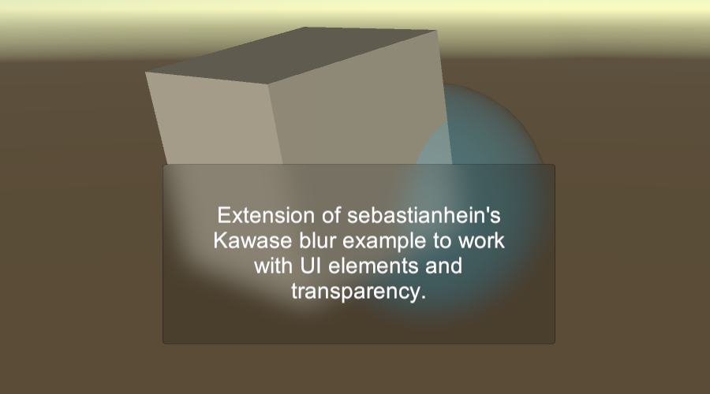

## Universal Render Pipeline UI Blur Renderer Extension

[sebastianhein](https://github.com/sebastianhein)'s [urp_kawase_blur](https://github.com/sebastianhein/urp_kawase_blur) implementation is a great example of an efficient blur implementation as a Renderer Extension. It however doesn't work well with UI elements. This fork is intended as an example on how it can be extended for this purpose. 

Usage:
* Add Kawase blur to your Renderer Features of your Forward Renderer asset
* Set the Render Pass Event to after Rendering
* Select the UIBlur material for any UI sprite you want to have a blurred background

Limitations:
* This implementation does not yet support blurring UI elements themselves

Developed with Unity 2019.3
